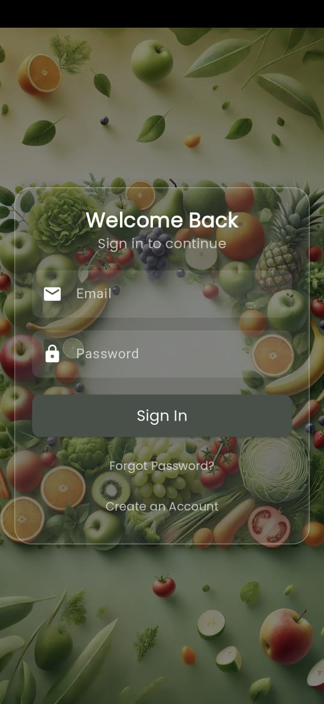
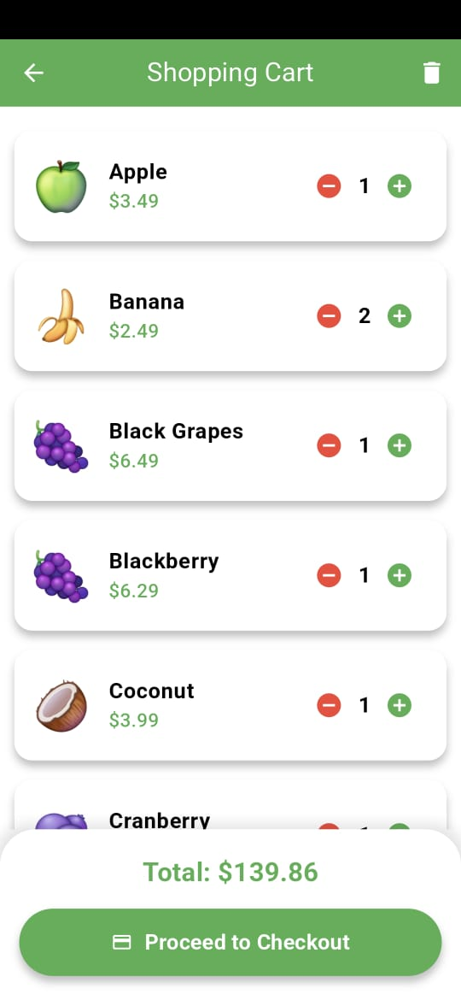
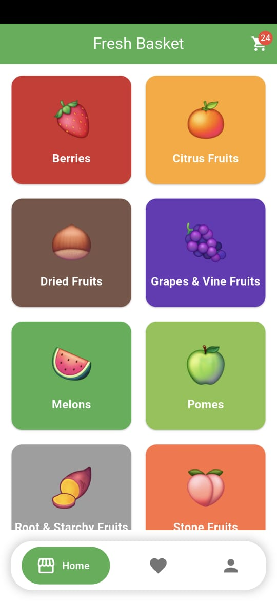
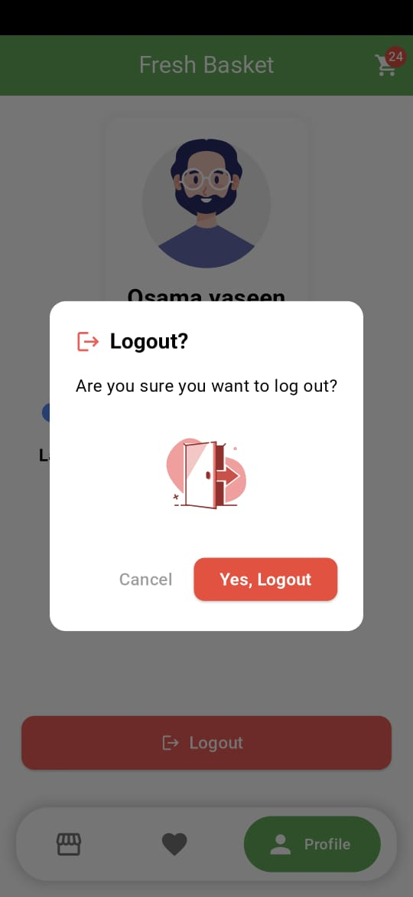
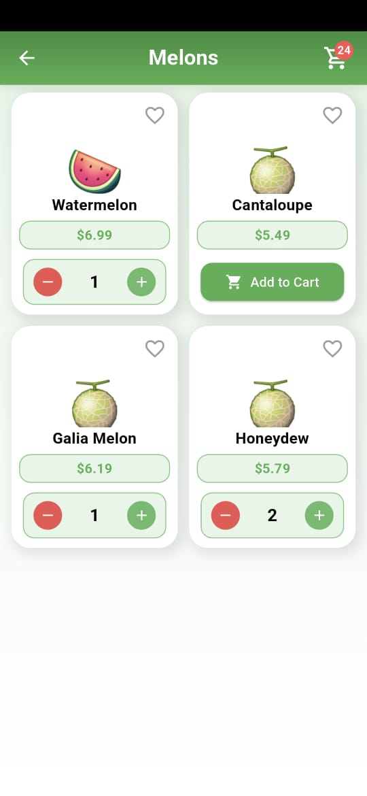

# 🛒 FreshBasket - Grocery Shopping App 🚀

FreshBasket is a modern grocery shopping app built with **Flutter & Firebase**.  
It allows users to browse products, add to cart, and manage their purchases seamlessly.

## 📸 Screenshots

 
  
  
  
  


## 🔥 Features

- 🏬 **Browse & Search Products**
- 🛍️ **Add to Cart & Wishlist**
- 🔐 **User Authentication & Profile Setup**
- 🌙 **Multi-language & Dark Mode Support**
- 📦 **Real-time product updates using Firebase**

## 📥 Download APK

➡️ [Download FreshBasket APK (v1.0.0)](https://github.com/osama-yaseen/FreshBasket/releases/latest)

## 🚀 Installation

```sh
git clone https://github.com/osama-yaseen/FreshBasket.git
cd FreshBasket
flutter pub get
flutter run
📌 Tech Stack
Flutter (Dart)
Firebase (Firestore, Auth, Storage)
GetX for State Management
Lottie for Animations
📬 Contact
📧 Email: osama.shehdeh.yaseen@gmail.com
```
